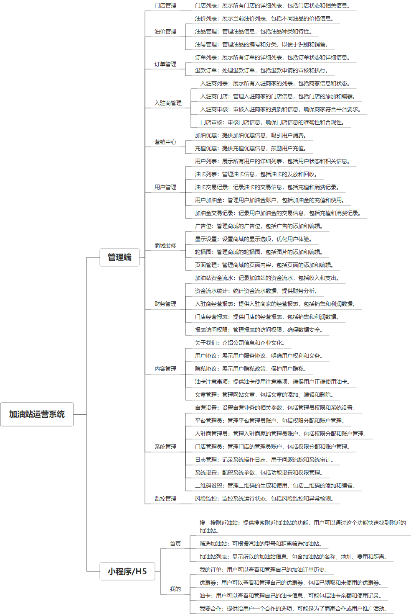

 

    
 

公司拥有上百套具有自主知识产权的软件系统，详情请查看码云首页或公司官网

 
<h1>加油站运营系统</h1>

<a href="https://www.haishi.net.cn/">公司官网</a> ｜ <a href="https://www.haishi.net.cn/">在线体验</a>

 

## 系统介绍

加油站运营系统是一个集成了多种功能的综合管理平台，系统提供H5、小程序，支持微信支付、支付宝支付、拉卡拉支付。帮助加油站实现高效、精准的运营管理。该系统涵盖了从员工管理、广告投放（如轮播图广告、优惠活动推广）到油品管理（包括油价、油号列表及油品信息维护）、资金管理（如资金流水监控、拉卡拉分账商户及接收方管理）、订单处理（涵盖订单列表、订单详情查看、退款订单管理）以及客户管理（例如加油卡发行、加油卡交易记录、加油金服务及交易记录追踪）等多方面的业务需求。此外，系统还提供了页面管理和报表权限设置等功能，以支持加油站的日常运营和数据分析工作，确保业务流程顺畅，提升服务质量与效率。
加油站运营系统是一个集成了多种功能的综合管理平台，系统提供H5、小程序，支持微信支付、支付宝支付、拉卡拉支付。帮助加油站实现高效、精准的运营管理。该系统涵盖了从员工管理、广告投放（如轮播图广告、优惠活动推广）到油品管理（包括油价、油号列表及油品信息维护）、资金管理（如资金流水监控、拉卡拉分账商户及接收方管理）、订单处理（涵盖订单列表、订单详情查看、退款订单管理）以及客户管理（例如加油卡发行、加油卡交易记录、加油金服务及交易记录追踪）等多方面的业务需求。此外，系统还提供了页面管理和报表权限设置等功能，以支持加油站的日常运营和数据分析工作，确保业务流程顺畅，提升服务质量与效率。
本项目为加油站运营系统，旨在实现加油站运营全流程管理，包括油价管理、订单管理、入驻商管理、用户管理、财务管理、内容管理、系统管理和监控管理等核心模块。该系统面向不同用户群体，提供多终端支持，例如管理后台、H5页面等。系统通过对加油站业务流程进行数字化管理，提升运营效率，降低运营成本，并为用户提供便捷的加油服务。
本项目从用户层面可以分为三个端：
- 管理后台：平台管理员、入驻商管理员、门店管理员使用，可以进行油价设置、订单管理、入驻商审核、用户管理、财务报表查看等操作。
- H5端：用户使用，提供自助加油、订单查询、优惠券使用、油卡管理、合作申请等功能。
                

## 系统功能介绍

### 系统包含终端说明

管理端（WEB）、用户端（微信小程序、H5）

| 序号 | 模块 | 模块说明 |
| --- | --- | --- |
| 1 | QT-JYZ-YY-H5 | H5端 |
| 2 | QT-JYZ-YY-MP | 小程序 |
| 3 | QT-JYZ-YY-SERVER | 服务端 |

### 系统功能结构

### 系统功能说明

核心功能：
- 油价管理：管理不同油品的油价，支持油价调整和油品信息维护。
- 订单管理：处理加油订单，包括订单列表查看、退款处理等。
- 入驻商管理：管理入驻加油站的商家，包括入驻申请审核、门店管理等。
- 用户管理：管理用户账户信息、油卡信息、加油金等。
- 财务管理：提供财务报表，包括资金流水、经营报表等，支持报表访问权限控制。
- H5自助加油：用户可以通过H5页面进行自助加油，提升加油效率和用户体验。

## 系统主要界面

## 系统技术说明

### 代码模块说明

| 序号 | 目录 | 目录说明 |
| --- | --- | --- |
| 1 | QT-JYZ-YY-SERVER/common-d-web | -- |
| 2 | QT-JYZ-YY-SERVER/module-store | -- |
| 3 | QT-JYZ-YY-SERVER/common-b-util | -- |
| 4 | QT-JYZ-YY-SERVER/module-api | -- |
| 5 | QT-JYZ-YY-SERVER/common-c-db | -- |
| 6 | QT-JYZ-YY-SERVER/common-c-db-generator | -- |
| 7 | QT-JYZ-YY-SERVER/module-mch | -- |
| 8 | QT-JYZ-YY-SERVER/module-admin | -- |
| 9 | QT-JYZ-YY-SERVER/.idea | -- |

### 系统技术选型

#### 开发语言/框架

JAVA（JDK1.8）
前端框架：VUE2
前端框架：uni-app
框架：SpringBoot2.x
系统结构：单体应用
前端框架：layui

#### 服务中间件

Nginx
Tomcat

#### 数据库

MySQL（5.7+）
Redis

#### 其他说明

无

## 系统演示/商用

请扫码添加客服微信获取演示地址和系统详细资料。

如果您想基于加油站运营系统进行商业化交付或定制开发服务，我们提供有偿的技术服务支持，合作模式不限，欢迎沟通！

公司官网地址： <a href="https://www.haishi.net.cn/">https://www.haishi.net.cn</a>

联系客服获取专业回答。

## 使用须知

1、 本项目商用必须获得版权所有者的授权。

2、 未经允许本项目代码不允许二次出售。

